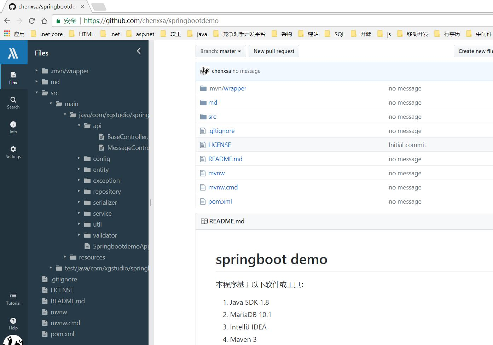
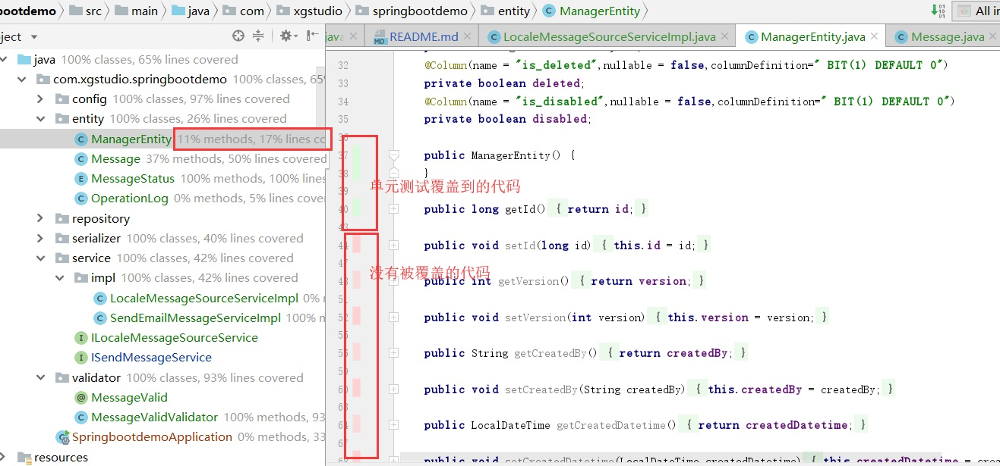

# springboot demo 
本程序基于以下软件或工具：
1. Java SDK 1.8 
2. MariaDB 10.1
3. IntelliJ IDEA 
4. Maven 3
5. chrome看github源码插件[](https://blog.csdn.net/geanwen/article/details/78918477)

## 目标
通过代码演示基于spring boot 2.0开发web服务器程序，并以目前了解情况，提供最佳实践，后续持续更新不足之处。
## 目录
### 第一部分
1. 基本介绍
2. 创建项目
3. 项目结构介绍和pom
4. Spring IOC 简单介绍和使用
5. 阿里巴巴Java开发规范及IDEA插件、IDEA代码质量提示 
6. 参数配置、自定义参数配置
7. Spring Data JPA、事务、动态查询、实体校验
8. 单元测试以及覆盖率
9. 数据库连接池扩展：Druid，并监控运行状况
10. Restful API开发：接收参数、验证参数、返回结果
11. 使用MockMvc进行单元测试
12. ObjectMapper扩展，处理LocalDate等数据类型
13. Restful API 开发进阶：返回统一数据结构和统一异常处理
14. Restful API 开发进阶：CROS
15. 多语言处理
16. 使用logback记录系统运行log
17. 支持web页面开发  
18. 配置访问静态资源
19. 部署
20. 性能测试 

### 第二部分：进阶开发 
1. 参数加密、分场景设定部署参数
2. 自定义权限验证
3. 使用ehcache缓存数据
4. 使用redis缓存数据
5. rabbitmq使用
6. mongodb使用
7. mongodb扩展
8. 异步线程处理请求并设置java线程数相关参数
9. 性能监控


## 一、基本介绍
spring boot非常适合构建web应用程序，有如下优点：
* 入门门槛低，抛弃了以前的各种配置，开箱即用；
* 开源模块多，构建应用速度块；
* 社区活跃，可快速找到各种教程和坑的解决方案；

开发工具强烈建议使用IDEA:
 
java界第一、宇宙第二直追vs的IDE： IntelliJ IDEA， 速度块，功能强大、方便使用。代码质量、快捷键、单元测试、调试查看源码比vs更强大！

强烈推荐2：[github 查看源码插件](https://www.cnblogs.com/softidea/p/7217330.html)：  
 
 
## 二、创建项目
1. 通过spring初始化器来添加项目，File -- New -- Project   

   
    
2. 设置项目项目信息  
  
    * 设置为maven的方式构建项目
    * Group 是项目组织唯一的标识符，实际对应JAVA的包的结构，是main目录里java的目录结构。
    * ArtifactID是项目的唯一的标识符，实际对应项目的名称，就是项目根目录的名称。
    * Version 版本号，SNAPSHOT为快照版本，一般在开发模式下，我们可以频繁的发布SNAPSHOT版本，以便让其它项目能实时的使用到最新的功能做联调；
  当版本趋于稳定时，再发布一个正式版本，供正式使用。当然在做正式发布时，也要确保当前项目的依赖项中不包含对任何SNAPSHOT版本的依赖，保证正式版本的稳定性。 [正式版和快照版本的区别](https://www.cnblogs.com/huang0925/p/5169624.html)
    * Package 包名，可以理解为命名空间；是main目录里java的目录结构。在java中，一个类的包名必须要目录结构一致，否则无法加载；
    * Group和ArtifactID使用**小写的方式**，因为它们都会对应的实际的目录结构，兼容不同操作系统对目录的大小写区别。
    * [maven官网文档中的命名约定指南](https://maven.apache.org/guides/mini/guide-naming-conventions.html)
    
3. 选择本项目依赖的包
 
    * 需要按照项目的需求来选择最小的依赖，在之后可以按需添加依赖；
    * 在demo的pom.xml的文件中已经对每个包做了解释。

4. 创建好项目后，在IDEA的右下角会自动弹出窗口，点击设置自动导入前面选择的依赖包。 
  
  
   也可以到设置界面选择，这样以后变更依赖包时会自动导入
  
  
## 三、项目结构介绍和pom
1. 根据上一节创建的项目，会创建如下代码：  
  
   
    * main/java/包名：存放的业务代码；其中java下存放代码，resources目录下存放资源文件，如图片、配置档、css、html等；
    * test/java/包名: 存放多有的测试用例；**建议测试用例的目录结构和业务代码的结构保持一致**
    * pom.xml : POM是项目对象模型(Project Object Model)的简称,它是Maven项目中的文件,
    该文件用于管理：项目的依赖关系、源代码、配置文件、开发者的信息和角色、 组织信息、项目授权、项目的url、等等。事实上，在Maven世界中，只要有pom.xml文件就可以开始一个项目。
    * External Libraries: 当前项目所有依赖的jar包、jdk等运行基础；由maven自动更新其中的依赖包；

2. POM文件
    pom文件定义了项目的基本信息、依赖关系、编译部署行为等。详细请大家找相关资料；  
    Spring boot项目的pom文件必须有maven的插件，如果是多模块项目，那么只能是启动项目有此插件：
    ```
     <plugin>
            <groupId>org.springframework.boot</groupId>
            <artifactId>spring-boot-maven-plugin</artifactId> 
     </plugin> 
    ```  
    我们在查询、更新、发布时，都会用到[maven的仓库网站](http://mvnrepository.com/)
 
## 四、Spring IOC 简单介绍和使用
   IOC/AOP是Spring的基石，需要深入理解方能真正掌握Spring。  
   
   Spring入门请参照 [Spring boot官方手册](https://docs.spring.io/spring-boot/docs/current-SNAPSHOT/reference/htmlsingle/)   
   
   **重点推荐**  [Spring 官方教程](https://docs.spring.io/spring/docs/5.0.2.RELEASE/spring-framework-reference/index.html)  
  
   推荐书籍： [Spring in Action](https://book.douban.com/subject/2282628/)  
  
1. 当我们添加Spring的相关包之后，我们就可以直接使用Spring的提供的服务;  
2. 我们自己创建服务则只需要在类上添加注解@Service或者@Component
    ```java
    /**
     * 发送邮件消息
     * @author chenxsa
     */
    @Service
    public class SendEmailMessageService implements ISendMessageService {
    }
    
    ```
    > @Service 是一种 @Component。 还有@Controller，@Repository都是一种@Component，用来在不同的场景下标记；
    
    > 服务或者组件默认是单例的；可以通过@Scope("prototype")指定多例，主要生命周期：prototype、request、session、global session

3.对于需要特殊构造函数的服务，我们需要通过配置的方式来提供服务。  
    
   ```java
   @Configuration
   public class ExtendConfig  { 
        /**
        * 提供对配置参数加密服务
        */
       @Bean(name = "encryptorBean")
       public StringEncryptor stringEncryptor() {
           PooledPBEStringEncryptor encryptor = new PooledPBEStringEncryptor();
           SimpleStringPBEConfig config = new SimpleStringPBEConfig();
           config.setPassword("digiwin.dap.middleware");
           config.setAlgorithm("PBEWithMD5AndDES");
           config.setKeyObtentionIterations("1000");
           config.setPoolSize("1");
           config.setProviderName("SunJCE");
           config.setSaltGeneratorClassName("org.jasypt.salt.RandomSaltGenerator");
           config.setStringOutputType("base64");
           encryptor.setConfig(config);
           return encryptor;
       }
    }
   ``` 
   > @Configuration代表当前是一个服务配置类，在内部标记为@Bean的函数则是服务提供者。spring boot 大量采用这种方式

4.使用服务 
  ```
        @Autowired
        ISendMessageService sendMessageService;
    
        @Autowired
        @Qualifier("encryptorBean")
        StringEncryptor stringEncryptor;
 ```
  
## 五、阿里巴巴Java开发规范及IDEA插件、IDEA代码质量提示 

1. 推荐按照阿里巴巴的开发规范来做代码规范，并使用其插件进行代码扫描  

    [阿里巴巴java开发规范地址](https://github.com/alibaba/p3c/blob/master/%E9%98%BF%E9%87%8C%E5%B7%B4%E5%B7%B4Java%E5%BC%80%E5%8F%91%E6%89%8B%E5%86%8C%EF%BC%88%E8%AF%A6%E5%B0%BD%E7%89%88%EF%BC%89.pdf)  

    [IDEA插件安装](https://www.cnblogs.com/cnndevelop/p/7697920.html)

2. 在写代码的时候，我们可以通过IDEA的代码质量提示来调整代码  

   在写代码过程中，IDEA会动态扫描代码，识别代码的不规范之处，或者存在bug的地方，并使用黄色警告显示在右边。  
   
     
      
    
   我们要尽量把所有的黄色警告都消灭来提高代码质量
   
## 六、参数配置、自定义参数配置
   参数主要通过application.yml 或者application.properties 文件来设定。
   1. 推荐使用application.yml，格式清爽；
   2. 一定要设置IDEA的文件格式为UTF-8，否则中文会乱码。**特别是团队开发，一个人不设置，会导致源码乱码，一旦上传后就要花时间去恢复。**
      
   3. IDEA对配置文件提供了语法支持，和参数检查。
         
     我们也可以通过ctrl + 鼠标左击参数，跳到参数对应的配置类，这样就可以来查看。
     比如点击第五点的username属性，会直接跳到类：org.springframework.boot.autoconfigure.jdbc.DataSourceProperties,这个类
     就是spring boot接收datasource相关的参数配置类。
     
   4. spring 所有参数在官网上可以。   
   [查看所有参数](https://docs.spring.io/spring-boot/docs/current-SNAPSHOT/reference/htmlsingle/#common-application-properties)      
   [中文翻译版本](https://blog.csdn.net/lpfsuperman/article/details/78287265)
  
   5. 我们马上需要使用mysql，这里先配置mysql的相关参数如下（**需要先建立好数据库：springbootdemo**）：
        ```yaml
        spring:
            datasource:
               driver-class-name: com.mysql.jdbc.Driver
               url: jdbc:mysql://localhost/springbootdemo
               username: root
               password: root
        ```
   6. 自定义参数配置如下：
        ```yaml
        springbootdemo:
          email:
            server: www.qq.com
            port: 403
        ```        
   7. 读取配置有2中方式：直接读、转化为参数配置类
        * 直接读取
        ```java
        @Service
        public class SendEmailMessageService implements ISendMessageService {
            @Value("springbootdemo.email.server")
            String server;
            @Value("springbootdemo.email.port")
            String port;
        }
        ```      
        * 通过配置对象读取  
         需要先在pom.xml添加依赖包，由spring在程序启动时读取参数到实体。
             ```xml
            <!--参数配置实体-->
            <dependency>
                <groupId>org.springframework.boot</groupId>
                <artifactId>spring-boot-configuration-processor</artifactId>
                <optional>true</optional>
            </dependency>
            ```
             然后添加配置类，配置类命名参照官方做法，以Properties结尾。
             ```java
            /**
             * 邮件服务器相关的参数
             * @author chenxsa
             */
            @Component
            @ConfigurationProperties(prefix = "springbootdemo.email")
            public class EmailProperties {
                private String server;
                private String port;
            
                public String getServer() {
                    return server;
                }
            
                public void setServer(String server) {
                    this.server = server;
                }
            
                public String getPort() {
                    return port;
                }
            
                public void setPort(String port) {
                    this.port = port;
                }
            }
            ```
        通过@Component 注解，把配置类变成唯一的服务组件。然后我们在其他服务中可以通过@Autowired直接注入：  
        
        ```java
            @Service
            public class SendEmailMessageService implements ISendMessageService {
                   @Autowired
                   EmailProperties emailProperties;      
            }      
        ```          
## 七、Spring Data JPA、事务、动态查询、实体校验
    
   在Spring中使用JPA ,首先需要在POM.XML中添加其依赖包。本demo在创建时已经自动添加。  
   
```xml 
        <!--支持实体与数据库的orm，并提供多种校验。 jpa相关语法和介绍参照官网-->
        <dependency>
            <groupId>org.springframework.boot</groupId>
            <artifactId>spring-boot-starter-data-jpa</artifactId>
        </dependency>
```

   需要使用到mysql，添加mysql的驱动包。本demo在创建时已经自动添加。
   
```xml 
        <!--mysql 驱动-->
        <dependency>
            <groupId>mysql</groupId>
            <artifactId>mysql-connector-java</artifactId>
            <scope>runtime</scope>
        </dependency>
```   
    
   1. JPA全称Java Persistence API，是java的**ORM规范**，实现POJO到数据库表映射。提供了：
        * JPA annotations，通过注解定义Entity，字段，以及关系；请参考[实体注解]( http://www.datanucleus.org/products/datanucleus/jpa/annotations.html) 
        * ORM， 通过管理、跟踪Entity，对数据库进行增删改查；
        * Criteria API， 面向对象查询的api。 
   2. JPA 是一个标准，Hibernate JPA是JPA的一种底层实现，其他的实现还有TopLink JPA、OpenJPA等。
   而Spring Data JPA是对JPA的实现上再做了一层业务封装，简化使用。目前Spring Data JPA底层还是主要使用Hibernate JPA。
   3.  Spring Data JPA：快速增删改查，分页
      Spring Data JPA 提供了通过命名规范来进行增删改查的API，简化开发。  
   [简单教程](https://www.ibm.com/developerworks/cn/opensource/os-cn-spring-jpa/index.html),     
   [官方教程](https://docs.spring.io/spring-data/data-jpa/docs/current/reference/html/)   
   通过继承接口JpaRepository 即可获取基于Entity的增删改查、分页、汇总等；继承JpaSpecificationExecutor则可以实现动态查询
        ```java 
               
               /**
                * 消息Repository
                * @author chenxsa
                */
               @Repository
               @Transactional(readOnly = true,rollbackFor = Exception.class)
               public interface MessageRepository extends JpaRepository<Message,Long>, JpaSpecificationExecutor<Message> {
               
                   /**
                    * 根据消息Id查询消息日志
                    * @param messageId
                    * @return
                    */
                   List<Message> findByMessageId(long messageId);
               
                   /**
                    * 根据消息Id更新消息状态
                    * @param messageStatus
                    * @param messageId
                    * @return
                    */
                   @Modifying
                   @Transactional(rollbackFor = Exception.class)
                   @Query(value = "update Message m set m.status=:messageStatus where m.id= :messageId")
                   int updateStatusByMessageId(@Param("messageStatus") MessageStatus messageStatus, @Param("messageId") long messageId) ;

               }
               
        ```      
         可以基于动词进行查询、删除、汇总统计：          
         ```
          And --- 等价于 SQL 中的 and 关键字，比如 findByUsernameAndPassword(String user, Striang pwd)；
          Or --- 等价于 SQL 中的 or 关键字，比如 findByUsernameOrAddress(String user, String addr)；
          Between --- 等价于 SQL 中的 between 关键字，比如 findBySalaryBetween(int max, int min)；
          LessThan --- 等价于 SQL 中的 "<"，比如 findBySalaryLessThan(int max)；
          GreaterThan --- 等价于 SQL 中的">"，比如 findBySalaryGreaterThan(int min)；
          IsNull --- 等价于 SQL 中的 "is null"，比如 findByUsernameIsNull()；
          IsNotNull --- 等价于 SQL 中的 "is not null"，比如 findByUsernameIsNotNull()；
          NotNull --- 与 IsNotNull 等价；
          Like --- 等价于 SQL 中的 "like"，比如 findByUsernameLike(String user)；
          NotLike --- 等价于 SQL 中的 "not like"，比如 findByUsernameNotLike(String user)；
          OrderBy --- 等价于 SQL 中的 "order by"，比如 findByUsernameOrderBySalaryAsc(String user)；
          Not --- 等价于 SQL 中的 "！ ="，比如 findByUsernameNot(String user)；
          In --- 等价于 SQL 中的 "in"，比如 findByUsernameIn(Collection<String> userList) ，方法的参数可以是 Collection 类型，也可以是数组或者不定长参数；
          NotIn --- 等价于 SQL 中的 "not in"，比如 findByUsernameNotIn(Collection<String> userList) ，方法的参数可以是 Collection 类型，也可以是数组或者不定长参数；
         ```
         > 不仅仅是查询时可以使用，也可以在delete，count时使用如上的模式。如
         void deleteByName(@Param("name") String name);
         详细参照 [官方教程](https://docs.spring.io/spring-data/data-jpa/docs/current/reference/html/#repositories.query-methods.query-creation)
         
         >这些动词可以合在一起使用
         
         > 动词后面连接的字段第一个字母可大写也可以小写，spring会自动处理，为了符合命名规范，一律大写。
         
         > 在使用动词加上字段的时候一定要注意，如果字段书写错误，spring boot 在启动过程中会出错，它会自动检查跟在动词后的字段是否存在。所以一旦启动报错显示无法创建我们定义的Repository，基本都时字段写错了
         
         
   4. Spring Data JPA：自定义查询    
   通过@Query我们可以自定义查询，可以执行任意的sql语句。注意，此sql时面向对象的，不是面向数据库的
   
        ```java 
               
               public interface ICalendarRepository extends JpaRepository<ICalendar,Long> { 
                     
                   /**
                    * 根据用户名来查询，返回必须字段
                    * @param userId
                    * @return
                    */
                   @Query(value = "select new map(t.id as id,t.name as name,t.color as color,t.defaultCalendar  as defaultCalendar) from ICalendar t where t.userId = :userId")
                   List<Map<String,Object>> findICalendarByUserId(@Param("userId")String userId); 
               
               }  
               
        ```       
   5. Spring Data JPA：动态查询   
   当我们的查询特别复杂，sql需要动态拼接时，需要动态查询，就是使用JPA的Criteria API。   
   有2种方式：第一种:通过JPA的Criteria API实现；第二种:DAO层接口实现JpaSpecificationExecutor<T>接口  
   使用方式见[范例](https://www.jianshu.com/p/45ad65690e33)，语法见
   [官方教程](https://docs.spring.io/spring-data/data-jpa/docs/current/reference/html/)  
   
   6. 事务  
   通过标记@Transactional 即可实现事务。 此标记只能标记在public 方法中.  
   事务的隔离级别，回滚方式，传递性,见[参考1](https://blog.csdn.net/nextyu/article/details/78669997)
   [官方文档](https://docs.spring.io/spring/docs/5.0.2.RELEASE/spring-framework-reference/data-access.html#transaction-declarative-annotations)    
   推荐做法：  
         ```
        @Transactional(readOnly = true,rollbackFor = Exception.class)
         ```        
        > 事务最终是需要db来支持的。Mysql在在建表的时候，一定要选择正确的存储引起，默认的MyISAM是不支持事务的，必须选择 InnoDB 
   
   7. 添加数据源以及JPA相关的参数配置.   
        参数的详细说明请自行查看：   [查看所有参数](https://docs.spring.io/spring-boot/docs/current-SNAPSHOT/reference/htmlsingle/#common-application-properties)      
                                        [中文翻译版本](https://blog.csdn.net/lpfsuperman/article/details/78287265)
                                          
        ```yaml
        spring:
          datasource:
            driver-class-name: com.mysql.jdbc.Driver
            url: jdbc:mysql://localhost/springbootdemo
            username: root
            password: root
          jpa:
            show-sql: true
            hibernate:
              ddl-auto: update
              dialect: org.hibernate.dialect.MySQL5Dialect
            database-platform: org.hibernate.dialect.MySQL5InnoDBDialect
        ```    
        > 注意事项  :  spring.jpa.hibernate.ddl-auto 这个字段用来控制hibernate如何生成、更新表结构的。  
        ddl-auto:none            不会更新表   
        ddl-auto:create          每次运行该程序，没有表格会新建表格，表内有数据会清空  
        ddl-auto:create-drop     每次程序结束的时候会清空表   
        ddl-auto:update          每次运行程序，没有表格会新建表格，表内有数据不会清空，只会更新   
        ddl-auto:validate        运行程序会校验数据与数据库的字段类型是否相同，不同会报错    
        如果不想通过 hibernate来更新表结构，可以通过 [flyway](https://flywaydb.org/documentation/plugins/springboot) 做数据库结构版本管理
   8. 定义实体、字段、关联   
        
        实体都在包entity中，详细见demo源码。 三张表的关系是: demo_message 和  demo_message_attend是主从表, demo_operation_log 有外键字段关联到demo_message
        
        > 注意事项  :  
        1: 在一对多，多对一的关系中，我们最终需要把实体变成json，会导致死循环，通过注解来解决：@JsonManagedReference，@JsonBackReference   
        2: Mysql 中的字段最好有默认，不要用null，null会带来更大的性能损耗；  
        3：columnDefinition这个属性可以扩展生成的sql 语句   
        
       在启动程序或者单元时,会自动在数据库中创建表:   
         
       
   9. 实体校验  
        在定义实体的时候,我们可以对实体定义校验，这样数据保存的时候、前端传入到Controller时，spring 会对数据合法性进行校验。如果不正确，会返回所有错误信息。  
        Spring种可以使用java校验框架JSR-303作为实体的校验基础。    
        [官方文档](https://docs.oracle.com/javaee/7/api/javax/validation/constraints/package-summary.html)   
        * 简单校验中文说明：
        ```
        限制	说明
        @Null	限制只能为null
        @NotNull	限制必须不为null
        @AssertFalse	限制必须为false
        @AssertTrue	限制必须为true
        @DecimalMax(value)	限制必须为一个不大于指定值的数字
        @DecimalMin(value)	限制必须为一个不小于指定值的数字
        @Digits(integer,fraction)	限制必须为一个小数，且整数部分的位数不能超过integer，小数部分的位数不能超过fraction
        @Future	限制必须是一个将来的日期
        @Max(value)	限制必须为一个不大于指定值的数字
        @Min(value)	限制必须为一个不小于指定值的数字
        @Past	限制必须是一个过去的日期
        @Pattern(value)	限制必须符合指定的正则表达式
        @Size(max,min)	限制字符长度必须在min到max之间
        @Past	验证注解的元素值（日期类型）比当前时间早
        @NotEmpty	验证注解的元素值不为null且不为空（字符串长度不为0、集合大小不为0）
        @NotBlank	验证注解的元素值不为空（不为null、去除首位空格后长度为0），不同于@NotEmpty，@NotBlank只应用于字符串且在比较时会去除字符串的空格
        @Email	验证注解的元素值是Email，也可以通过正则表达式和flag指定自定义的email格式
        ```   
         * 复杂校验，详细见包validator中对消息进行校验。   
   
        ```java 
               
                /**
                 *  第一步，定义消息校验注解
                 * @author chenxsa
                 */
                @Documented
                @Target({ ElementType.FIELD,ElementType.TYPE })
                @Retention(RetentionPolicy.RUNTIME)
                @Constraint(validatedBy={MessageValidValidator.class})
                public @interface MessageValid {
                   
                }
                
                /**
                 * 第二步，定义消息自定义校验，**目前还没有找到怎么注入其他服务**
                 * @author chenxsa
                 */
                public class MessageValidValidator implements ConstraintValidator<MessageValid, Object> {
                }
                
                /**
                 * 第三步，在实体上添加注解
                 * @author chenxsa
                 */
                @Entity
                @Table(name = "demo_message_log")
                @MessageValid
                public class Message extends ManagerEntity {
                }
               
        ```              
   10. 定义Repository   
    dao操作在Repository包中，在详细见demo源码。  
    [简单教程](https://www.ibm.com/developerworks/cn/opensource/os-cn-spring-jpa/index.html),     
    [官方教程](https://docs.spring.io/spring-data/data-jpa/docs/current/reference/html/)   
  
## 八、单元测试 
   spirng boot 使用junit做单元测试，不过对其进行了封装。需要在pom.xml中添加依赖：
   
   ```xml 
        <!--junit 测试-->
        <dependency>
            <groupId>org.springframework.boot</groupId>
            <artifactId>spring-boot-starter-test</artifactId>
            <scope>test</scope>
        </dependency>
   ```

   1. 对于我们写的每个业务逻辑，我们都需要对其进行单元测试。
   2. 单元测试首先要保证覆盖率，要保证业务流程都有覆盖。可以使用IDEA的覆盖率很方便了解到我们的哪些语句没有被测试到。
   3. 单元测试需要保证能重复执行。
        * 在不同的机器上能执行，所以不能依赖本地的内容，比如操作本地的某个文件；
        * 如果操作到数据库，则需要保证每次测试都能自行初始化数据，测试完毕之后，清理本次测试的数据；
   4. 测试的包和业务代码的包保持一致性。  
    
   5. 命名: 测试类 + Tests 
   6. 请按照如下demo来写测试类：
     
        ```java 
               
               /**
                * @author chenxsa
                */
               @RunWith(SpringJUnit4ClassRunner.class)
               @SpringBootTest(classes = SpringbootdemoApplication.class)
               @WebAppConfiguration
               public class MessageRepositoryTests {
                   @Autowired
                   MessageRepository messageJpa; 
               
                   @Test
                   public void insertTest(){
                       Message message=new Message();
                       try {
                           message.setContext("test message");
                           message.setStatus(MessageStatus.SEND);
                           message=messageJpa.save(message);
               
                           Assert.assertTrue(message.getId()>0);
                           Assert.assertTrue(messageJpa.count()==1);
                       }
                      finally {
                           messageJpa.delete(message);
                       }
                   } 
                   @Rule
                   public ExpectedException thrown= ExpectedException.none();
                   /**
                    * 测试校验不过的情况
                    */
                   @Test
                   public void insertValidTest() {
                       thrown.expect(TransactionSystemException.class);
                       Message message = new Message();
                       message.setContext("demo");
                       message.setStatus(MessageStatus.SEND); 
                       messageJpa.save(message); 
                   }
               }

               
        ```     
   7. **推荐做法**如果测试的数据库支持事务,我们可以在测试用例上添加如下注解,则测试完成之后,不论成功失败,都会撤销事务.
        ```java
               @Transactional
               @Rollback(true)
               @Test
               public void updateTest() {
                   Message message = new Message(); 
                   message.setContext("test message");
                   message.setStatus(MessageStatus.SEND);
                   message = messageJpa.save(message); 
                   Assert.assertTrue(message.getId() > 0);
                   Assert.assertTrue(messageJpa.count() == 1);
                   message.setStatus(MessageStatus.SUCCESS);
                   messageJpa.save(message); 
                   message = messageJpa.findById(message.getId()).get();
                   Assert.assertTrue(message.getStatus() == MessageStatus.SUCCESS);
               }
        ```
   8. 执行单元测试。   
   
         
   9. 执行单元测试查看覆盖率   
           
      查看整体覆盖率：    
            
      查看项目的文件覆盖情况  ：
      
         
      查看具体的类的覆盖情况   ：
      
         
    
## 九、 数据库连接池扩展：Druid，并监控运行状况      

   直接查看[官方文档](https://github.com/alibaba/druid/tree/master/druid-spring-boot-starter)
   1. 添加依赖包   
      ```xml 
        <!--alibaba d数据库连接池和监控-->
        <dependency>
            <groupId>com.alibaba</groupId>
            <artifactId>druid-spring-boot-starter</artifactId>
            <version>1.1.10</version>
        </dependency>
      ```
   2. 如果有权限验证包,暂先去掉pom中权限控制依赖包
         ```xml 
       <!--支持权限验证-->
        <!--<dependency>-->
            <!--<groupId>org.springframework.boot</groupId>-->
            <!--<artifactId>spring-boot-starter-security</artifactId>-->
        <!--</dependency>-->
         ```
   3. 启动项目,登陆后台界面: http://localhost:8080/druid/index.html   
   输入数据库用户名和密码后,进入监控后台:   
         
   
    
##  十、 Restful API开发：接收参数、验证参数、返回结果   
   Spring mvc 处理机制,请参考: [spring web](https://docs.spring.io/spring/docs/current/spring-framework-reference/web.html)
   1. 确保存在依赖包   
      ```xml 
        <!--web服务端必须，只要提供了spring mvc 以及相关的支持-->
        <dependency>
            <groupId>org.springframework.boot</groupId>
            <artifactId>spring-boot-starter-web</artifactId>
        </dependency>
      ```
   2. 使用常用注解来处理请求,返回结果  
        * @Controller 处理http请求,一般用来处理返回网页等; 
        * @ResponseBody : 返回json
        * @RestController :相当于 @Controller+@ResponseBody
        * @RequestMapping:  配置url映射
        * @GetMapping ,@PostMapping : 相当于@RequestMapping的一个具体实例
   3. 使用常用注解来接收参数,验证参数
        * @PathVariable : 获取url中的数据
        * @RequestParam:   获取请求参数的值,也可以处理Content-Type: 为 application/x-www-form-urlencodedbody的值.
        * @RequestBody: 获取Content-Type: 不是application/x-www-form-urlencoded编码的内容，例如application/json, application/xml等的body部分的值
        * @ModelAttribute获取POST请求的FORM表单数据
        * @RequestHeader, @CookieValue: 处理request header部分的注解 
         
   4. 参数验证
        * @Valid 通过在此注解,可触发在实体上定义的校验;
   5. 使用ResponseEntity对象来统一封装返回的值.Spring会根据场景自动进行序列化     
   6. 遵守 [Restful API的规范](https://blog.csdn.net/u010622769/article/details/54341363).
        * 对于能语义化的完全遵守此规范;
        * 对于有些GET,需要传递结构化的或者比较多的数据,可以转为POST,然后再body中传递参数值.
   7. 针对json创建实体的实践:   
        我们可以把和客户交互的数据,都需要在json 和 实体之间转换,那么我们应该怎么建立这些实体?
        * json传递过程数据,如查询参数, 建议在api.model包下为其建立一般实体和json对应
        * 返回json如果字段较少,直接返回Map对象即可;
        * 传递数据库实体,如新增\修改一个订单, 直接使用entity包下的业务实体;
        * 返回单个实体,以及单个实体的关联实体属性,直接返回entity,但是在返回之前,需要将需要返回的关联对象加载到对象模型中;
        * 返回多个实体,自定义查询的可通过Criteria API直接返回map字典,不推荐建立view实体,弹性不足; 
        
   8. controller中如果是对数据修改或者删除,需要添加事务 @Transactional,且需要把对应的函数标记为public
   9. 代码自行查看api包
   
##  十一. 使用MockMvc进行单元测试
   当我们写好api之后,强烈建议api都使用junit的MockMvc来模拟http请求测试.并组织好真实模拟数据.
   * 白盒测试代码;
   * 确保以后对api的调整需强制修改测试用例
   * 测试中使用的数据,返回的结果都是我们后面写帮助文档的来源.
   1. 使用MockMvc测试时,需要添加如下包:
       ```xml 
        <dependency>
            <groupId>com.jayway.jsonpath</groupId>
            <artifactId>json-path</artifactId>
            <version>2.3.0</version>
            <scope>test</scope>
        </dependency>
        <!--junit 测试-->
        <dependency>
            <groupId>org.springframework.boot</groupId>
            <artifactId>spring-boot-starter-test</artifactId>
            <scope>test</scope>
        </dependency>
       ```       
   2. 添加测试用例如下:
      ``` java
             /**
              * @author chenxsa
              */
             @RunWith(SpringJUnit4ClassRunner.class)
             @SpringBootTest(classes = SpringbootdemoApplication.class)
             @WebAppConfiguration
             public class MessageControllerTests {
                 //注入WebApplicationContext
                 @Autowired
                 private WebApplicationContext webContext;
             
                 private MockMvc mockMvc;
             
                 @Autowired
                 ObjectMapper objectMapper;
             
                 @Before
                 public void setupMockMvc() {
                     //设置MockMvc
                      mockMvc = MockMvcBuilders
                             .webAppContextSetup(webContext)        
                            // .addFilter(jwtAuthenticationFilter,"/*")
                             .build();
                 }
                 @Transactional
                 @Rollback(true)
                 @Test
                 public void sendTest() throws Exception {
                     Message message=new Message();
                     message.setContext("test message");
                     message.setStatus(MessageStatus.SEND);
                     Attendee attendee=new Attendee();
                     attendee.setMessage(message);
                     attendee.setUserEmail("test@qq.com");
                     attendee.setUserName("test");
                     message.getAttendees().add(attendee); 
                     String json= objectMapper.writeValueAsString(message); 
                     MvcResult mvcResult = mockMvc.perform(MockMvcRequestBuilders
                             .post("/api/demo/v1/messages/send")
                             .header("auth-user","demo")
                             .contentType(MediaType.APPLICATION_JSON_UTF8)
                             .content(json)
                             .accept(MediaType.APPLICATION_JSON))
                             .andDo(print())
                             .andExpect(status().isOk())
                             .andExpect(jsonPath("$.sid").exists())
                             .andExpect(jsonPath("$.msg").value("发送成功"))
                             .andReturn();
                     json=  mvcResult.getResponse().getContentAsString();
                      Map<String, String> result=  objectMapper.readValue(json, new TypeReference<HashMap<String, String>>() { });
                     String sid =  result.get("sid");
                     mockMvc.perform(MockMvcRequestBuilders
                             .delete("/api/demo/v1/messages/"+sid)
                             .header("auth-user","demo")
                             .contentType(MediaType.APPLICATION_JSON_UTF8)
                             .content("")
                             .accept(MediaType.APPLICATION_JSON))
                             .andDo(print())
                             .andExpect(status().isOk())
                             .andReturn(); 
                 } 
             }

      ```
       > 在测试用例开始前,使用MockMvcBuilders构建MockMvc
       
       > MockMvc 不仅是传递json,所有类型的数据都可以模拟,特别是模拟文件上传下载等比工具测试方便好多.
         
       > 使用jsonPath对返回的json进行判断. [jsonpath语法参照](http://goessner.net/articles/JsonPath/index.html#e2)
       
       > ObjectMapper是jackson用来序列化和反序列化json的主要对象,spring boot 默认使用jackson
       
## 十二. ObjectMapper扩展，处理LocalDate等数据类型
   
   Spring boot 默认使用jackson用来序列化和反序列化json,可以替换为fastjson或者gson.  
   ObjectMapper在处理LocalDate,或者一些自定义类型时,序列化的结果和我们逾期的不一致,那么需要对其进行扩展.  
   对Spring boot默认的服务,我们可以自定义配置类来扩展新.  
   代码可参见包config下的JsonConfig和WebMvcConfigurationExtendConfig类:
   
   ``` java
               @Configuration
               public class JsonConfig { 
               
                   @Bean
                   @Primary
                   public ObjectMapper getObjectMapper(){
                       return WebMvcConfigurationExtendConfig.createObjectMapper();
                   }
                   
                    static ObjectMapper objectMapper =null;
                   
                       /**
                        * 返回全局唯一的ObjectMapper
                        *
                        * @param
                        * @return
                        * @author chenxsa
                        * @date 2018-5-16 15:38
                        */
                       public static ObjectMapper createObjectMapper(){
                           if (objectMapper ==null) {
                               synchronized (WebMvcConfigurationExtendConfig.class) {
                                   if (objectMapper == null) {
                                       JavaTimeModule javaTimeModule = new JavaTimeModule();
                                       javaTimeModule.addSerializer(LocalDate.class, new LocalDateSerializer());
                                       javaTimeModule.addDeserializer(LocalDate.class, new LocalDateDeserializer());
                                       javaTimeModule.addSerializer(LocalDateTime.class, new LocalDateTimeSerializer());
                                       javaTimeModule.addDeserializer(LocalDateTime.class, new LocalDateTimeDeserializer());
                                       javaTimeModule.addSerializer(LocalTime.class, new LocalTimeSerializer());
                                       javaTimeModule.addDeserializer(LocalTime.class, new LocalTimeDeserializer());
                                       javaTimeModule.addSerializer(Timestamp.class, new TimestampSerializer());
                                       javaTimeModule.addDeserializer(Timestamp.class, new TimestampDeserializer());
                                       objectMapper = Jackson2ObjectMapperBuilder.json()
                                               .serializationInclusion(JsonInclude.Include.NON_NULL)
                                               .featuresToDisable(SerializationFeature.WRITE_DATES_AS_TIMESTAMPS)
                                               .modules(javaTimeModule)
                                               .build();
                                   }
                               }
                           }
                           return objectMapper;
                       }
                       
                   
                }
                
                
                /**
                 * 序列化
                 * @author chenxsa 
                 */
                public class LocalDateSerializer extends JsonSerializer<LocalDate> {
                    /**
                     * 将日期变成yyyy-MM-dd
                     * @param value
                     * @param gen
                     * @param serializers
                     * @throws IOException
                     */
                    @Override
                    public void serialize(LocalDate value, JsonGenerator gen, SerializerProvider serializers) throws IOException {
                        gen.writeString(value.format(Constants.DATE_FORMATTER));
                    }
                }
   
   ```   
   > 这里使用静态函数的方式是因为ObjectMapper需要在一些非服务环境下使用.  
 
   > 需要重写WebMvcConfigurationExtendConfig中的方法configureMessageConverters，来扩展消息转换器
   
   > 目前扩展的序列化器在包serializer下。                
